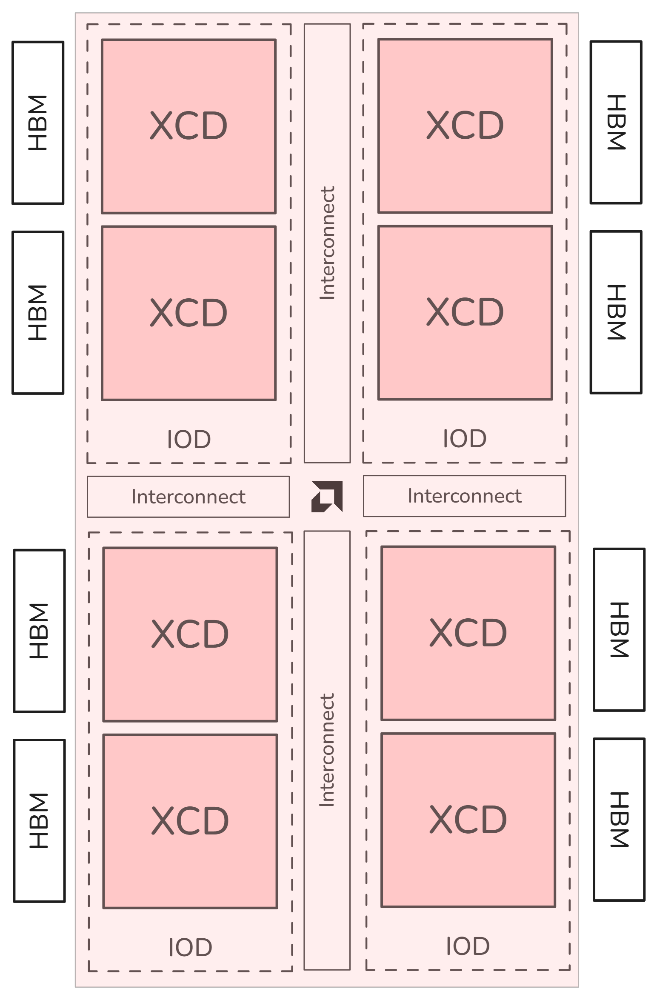
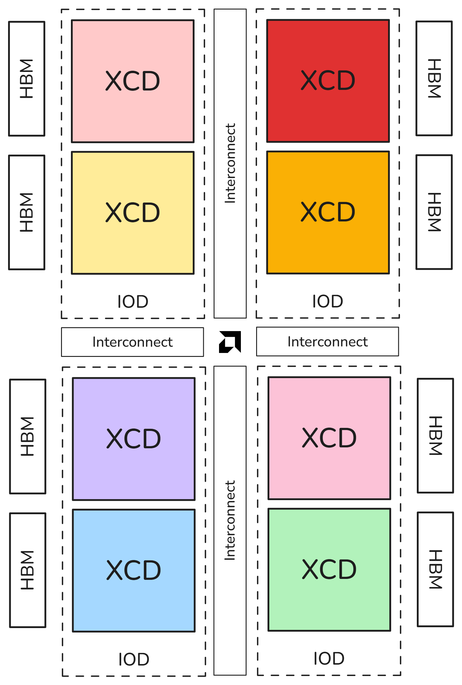
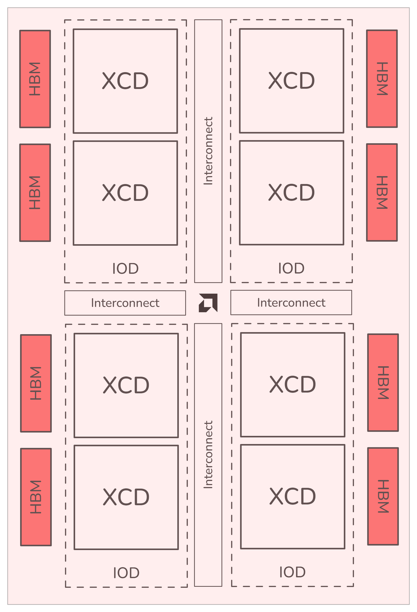
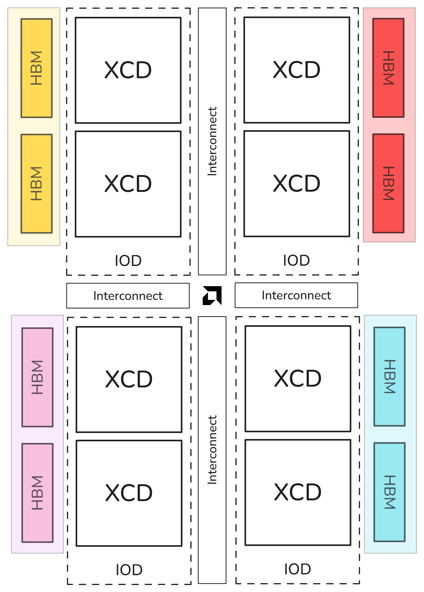

# GPU Partitioning Guide for SPX, CPX on Baremetal OS for MI300X

## 1. GPU Partitioning Overview

### a. Core Concepts

AMD Instinct MI300X GPUs support compute and memory partitioning to expose internal hardware resources as logical devices, enhancing flexibility and performance tuning for HPC workloads.

- The architecture consists of XCD (Accelerator Complex Die) and IOD (I/O Die).
- Contains 8 XCDs and 4 IODs, with each pair of XCDs 3D-stacked on an IOD.
- Features an inter-die interconnect for communication.
- Implements High-Bandwidth Memory (HBM) with 8 stacks (2 per IOD).

### b. Partition Types

**Compute Partitioning:**

- **Compute Partitioning (CPX, SPX):**
  - **SPX (Single Partition X-celerator):** All 8 XCDs are viewed as a single device.
  - **CPX (Core Partitioned X-celerator):** Each XCD is exposed as a separate logical GPU, offering finer scheduling control.

| Compute Mode | Description                                  | Visible Devices |
|-------------|----------------------------------------------|-----------------|
| **SPX**     | Unified compute view (all XCDs)              | 1 device        |
| **CPX**     | Disaggregated compute (per XCD)              | 8 devices       |

| [](../images/SPX.png) | [](../images/CPX.png)  |
| ----------------------------------------------- | ------------------------------------------------ |
| **SPX:** All XCDs appear as one logical device. | **CPX:** Each XCD appears as one logical device. |

**Memory Partitioning:**

- **Memory Partitioning (Non Uniform Memory Access Per Socket - NPS):**
  - **NPS1:** All HBM memory is exposed as a unified pool (compatible with SPX & CPX).
  - **NPS4:** Pairs of HBM stacks form separate partitions (compatible only with CPX), enabling improved memory locality.

| Memory Mode | Description                   | Compute Mode Compatibility |
|-------------|-------------------------------|----------------------------|
| **NPS1**    | Unified HBM memory pool      | SPX, CPX                   |
| **NPS4**    | Partitioned memory quadrants | CPX only                   |

| [](../images/NPS1.png) | [](../images/NPS4.png)    |
| ------------------------------------------------- | ---------------------------------------------------- |
| **NPS1:** All HBM stacks appear as one partition. | **NPS4:** Pairs of HBM stacks appear as a partition. |

[//]: # "> **Note:** These compute and memory partitioning modes leverage SR-IOV (Single Root I/O Virtualization) for isolation and hardware-level protection between partitions."

### c. Prerequisites

- Compatible firmware and kernel-level support.
- AMD ROCm toolchain and `amd-smi` utility.
- Bare-metal deployment without hypervisors.

### d. System Requirements

- MI300X GPU
- ROCm >= 6.4
- Linux Kernel >= 5.15
- amdgpu-build=2120656 (AMD GPU drivers)
- 15593 ROCm (Radeon Open Compute) software build

[//]: # "- SR-IOV and IOMMU enabled in BIOS."
[//]: # "- system BIOS firmware."

## 2. Hardware Compatibility List

### a. Firmware Requirements

- 

### b. Operating System Requirements

- Ubuntu 22.04+, 24.04+.

### c. Driver Requirements

- ROCm Driver >= 6.4
- `amd-smi` tool required for mode switching and diagnostics.

## 3. First Partition / Quick Start

### a. Creating CPX/NPS4 Partition

```bash
amd-smi set --compute-partition {CPX, SPX, TPX}
# Set one of the following the compute partition modes: CPX, SPX, TPX
amd-smi set --memory-partition {NPS1, NPS4}
# Set one of the following the memory partition modes: NPS1, NPS4
```

**Example:**

```bash
amd-smi set --gpu all --compute-partition CPX
amd-smi set --gpu all --memory-partition 
```

This configuration:

- Sets compute partitioning to CPX mode
- Configures memory partitioning to NPS4 mode
- Enables separate logical GPU treatment for each XCD
- Creates separate memory partitions for HBM stack pairs

<!-- ...existing code... -->

### b. Verifying Partition Creation

Partition verification can be performed using the `amd-smi` utility that checks the active partition modes and device configurations:

```bash
amd-smi --showmeminfo vram
amd-smi --showtopo
```

### c. Running Basic Tests

Use ROCm sample apps or HIP-based tests to verify each logical device.

**Example:**
