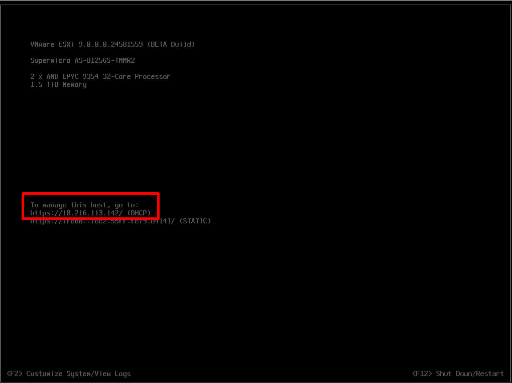
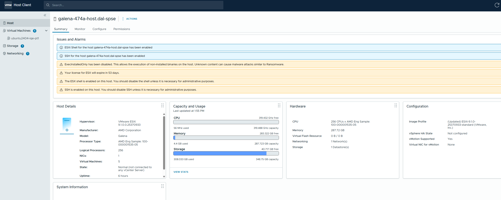
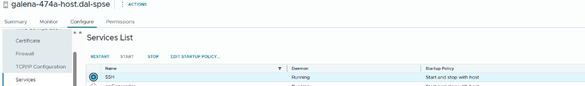
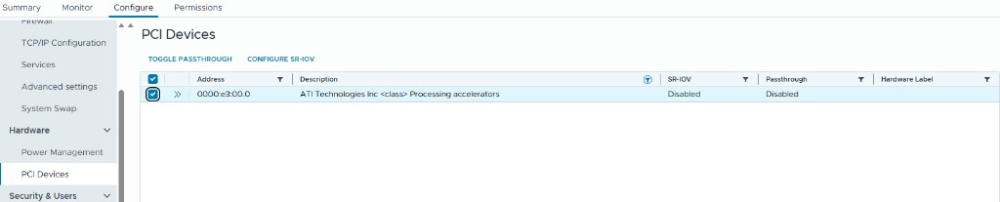
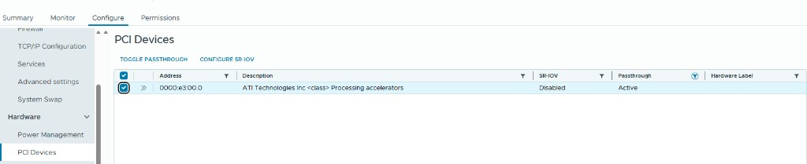

.. meta::
   :description: Configure the VMware ESXi host for MI350P GPU passthrough, including SSH access and PCI passthrough enablement.
   :keywords: AMD, MI350P, ESXi, host setup, SSH, PCI passthrough, DirectPath I/O, VMware Host Client

ESXi host setup for MI350P passthrough
=======================================

This section describes the ESXi host configuration required before you create a virtual machine with MI350P GPU passthrough. A prerequisite for this setup is an ESXi installation on the host machine. This guide uses ESXi 9.1, but the procedure should be similar for other ESXi versions in the 9.x family.

Access the ESXi host web UI
----------------------------

You need access to the host web UI. You can obtain the link from the system initial boot page after the ESXi host starts.

   ESXi host web UI address from the initial boot page. The Direct Console User Interface (DCUI) displays the HTTPS management URL (for example, ``https://10.216.113.142/``) that you use to open the VMware Host Client in a browser.

After a successful login, the ESXi host welcome screen confirms that the installation is healthy and the host is ready for configuration.

   ESXi host welcome screen after login. The **Summary** tab shows host details, capacity and usage, and any active alarms (such as SSH enabled or license expiration notices).

Enable SSH on the ESXi host
---------------------------

You use SSH access during VM installation, for example, to download the Ubuntu installer ISO to a datastore. Enable SSH as follows:

#. Navigate to **Configure → Services**.
#. Select **SSH** from the Services list.
#. Click **Start**.

Optionally, use **Edit Startup Policy** to set SSH to **Start and stop with host** so it remains available after a reboot.

   Enable SSH under **Configure → Services**. Select **SSH** from the Services list, confirm the daemon status is **Running**, and click **Start**. Use **Edit Startup Policy** to keep SSH available after a host reboot.

Enable passthrough for MI350P GPUs
-----------------------------------

Toggle passthrough mode for the MI350P GPUs before you assign them to a virtual machine:

#. Navigate to **Configure → Hardware → PCI Devices**.
#. Type **Processing accelerators** in the search bar to filter the list to MI350P GPUs. This label appears in the ESXi UI for the MI350P device class.
#. Select the device, or all devices if you are assigning more than one, by ticking the checkbox.
#. Click **Toggle passthrough**.

   Enable passthrough for MI350P GPUs under **Configure → Hardware → PCI Devices**. Filter by **Processing accelerators**, select the target device or devices, and click **Toggle passthrough**. Before toggling, the **Passthrough** column shows **Disabled**.

After the operation completes, refresh the PCI Devices page. The **Passthrough** column should show **Active** for each selected MI350P device.

   Passthrough status **Active** after refresh. Each selected MI350P GPU should show **Passthrough: Active** before you proceed to VM creation.

.. note::
   Passthrough must be enabled at the host level before you can add a GPU to a VM as a **Fixed DirectPath IO** PCI device.

Continue to guest setup
-----------------------

After SSH is enabled and passthrough is active for all target MI350P GPUs, proceed to :doc:`Ubuntu 24.04 guest setup <ubuntu-guest-setup>` to create and configure the virtual machine.
