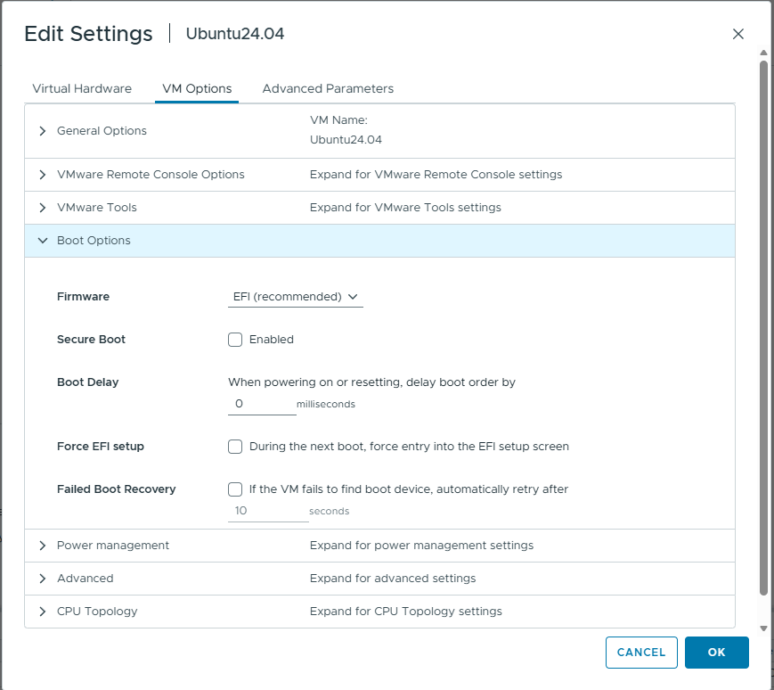

.. meta::
   :description: Install ROCm and the AMD GPU driver in an Ubuntu 24.04 guest VM after MI350P GPU passthrough on ESXi.
   :keywords: AMD, MI350P, ROCm, AMDGPU, ESXi, guest install, Ubuntu 24.04, Secure Boot, amd-smi

Install ROCm and the AMD GPU driver in the guest
=================================================

After you :doc:`assign MI350P GPUs to the Ubuntu guest <ubuntu-guest-setup>` and :doc:`verify GPU detection <ubuntu-guest-setup>` with ``lspci``, install :doc:`ROCm <rocm-install-on-linux:install/quick-start>` and the :doc:`AMD GPU driver on Ubuntu 24.04 <../../../install/detailed-install/package-manager/package-manager-ubuntu>` in the guest operating system.

Install ROCm in the guest
--------------------------

The guest needs the Radeon Open Compute (ROCm) software stack for GPU compute workloads. ROCm supports multiple installation methods on Linux, including package manager, container, and Spack-based installs.

Follow the **ROCm installation for Linux** documentation in the guest:

- :doc:`System requirements <rocm-install-on-linux:reference/system-requirements>`
- :doc:`Quick start installation <rocm-install-on-linux:install/quick-start>` (recommended for new users)
- :doc:`Detailed installation <rocm-install-on-linux:install/detailed-install>` (includes explanations and additional options)

For other supported methods, see the ROCm installation guide sections on :doc:`Docker containers <rocm-install-on-linux:how-to/docker>` and :doc:`Spack <rocm-install-on-linux:how-to/spack>`.

.. tip::
   When you install ROCm in the guest, select **Ubuntu 24.04** in the ROCm installation instructions to match this guide.

Install the AMD GPU driver on Ubuntu 24.04
-------------------------------------------

The AMDGPU kernel-mode driver must be installed in the guest so ROCm can use the passthrough GPU. Use the Ubuntu 24.04 package manager instructions in this documentation set:

#. Complete :doc:`Installation prerequisites <../../../install/detailed-install/prerequisites>` in the guest.
#. Follow :doc:`Ubuntu native installation <../../../install/detailed-install/package-manager/package-manager-ubuntu>` and select the **Ubuntu 24.04** tab when you register repositories and install ``amdgpu-dkms``.

.. note::
   The AMDGPU driver install and ROCm install are separate steps. Install the AMDGPU driver first, reboot the guest if prompted, then install ROCm using your preferred method from the ROCm installation guide.

Resolve Secure Boot and driver loading issues
----------------------------------------------

Upon installing the driver, the first ``modprobe`` might fail depending on Secure Boot settings. If that happens, use one of the following approaches:

- **Reboot the VM** and enroll the new keys when prompted, or
- **Disable Secure Boot** in the VM configuration under **VM Options → Boot Options** by unchecking **Secure Boot**.

   Disable Secure Boot in the VM configuration if ``modprobe`` fails. Open **Edit Settings → VM Options → Boot Options**, confirm **Firmware** is set to **EFI (recommended)**, and uncheck **Secure Boot** before you retry driver installation.

.. important::
   If you blacklisted ``amdgpu`` during guest setup (see :doc:`Ubuntu 24.04 guest setup <ubuntu-guest-setup>`), remove or comment out the blacklist entries in ``/etc/modprobe.d/blacklist.conf`` and run ``sudo update-initramfs -u`` before you install the driver.

Verify driver installation
---------------------------

After installation completes, verify that the AMDGPU driver loaded and the MI350P device is accessible:

.. tab-set::

   .. tab-item:: Command

      .. code-block:: shell-session

         # Verify GPU is visible to the driver
         amd-smi list

   .. tab-item:: Expected output

      ::

         GPU: 0
            BDF: 0000:XX:00.0
            ...

If ``amd-smi list`` reports the assigned MI350P device or devices, the passthrough and driver installation workflow is complete.
