.. meta::
   :description: Create and configure an Ubuntu 24.04 virtual machine on ESXi for MI350P GPU passthrough, including MMIO sizing and PCI device assignment.
   :keywords: AMD, MI350P, ESXi, Ubuntu 24.04, guest setup, MMIO, PCI passthrough, DirectPath I/O, virtual machine

Ubuntu 24.04 guest setup for MI350P passthrough
=================================================

Setting up Ubuntu 24.04 as a virtual machine in ESXi with GPU passthrough requires specific configuration steps to ensure proper performance and device recognition. This section covers VM creation, system requirements, guest operating system preparation, MMIO passthrough parameters, and GPU assignment.

Complete the steps in :doc:`ESXi host setup <host-setup>` before you start this section.

Download the Ubuntu installer ISO
----------------------------------

Download the Ubuntu 24.04 installer image to an ESXi datastore so it is visible from the web UI when the VM creation process starts.

On the ESXi host, navigate to the ``/vmfs/volumes`` directory, list available datastores, and download the installer ISO to one of the ``datastoreX`` directories.

.. tab-set::

   .. tab-item:: ESXi host shell

      .. code-block:: shell-session

         cd datastore1
         wget https://releases.ubuntu.com/24.04.2/ubuntu-24.04.2-desktop-amd64.iso \
            --no-check-certificate -S
         # Make sure to update the installer if offered.
         #
         # Or the server version:
         # wget https://releases.ubuntu.com/24.04.2/ubuntu-24.04.2-live-server-amd64.iso \
         #   --no-check-certificate -S

   .. tab-item:: Allow HTTP through firewall

      If the ``wget`` command gets stuck, allow the HTTP client through the ESXi firewall and try again:

      .. code-block:: shell-session

         esxcli network firewall ruleset set -e true -r httpClient

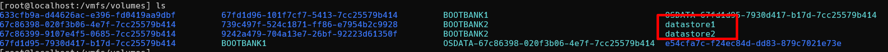

   List ``/vmfs/volumes`` on the ESXi host. One or more ``datastoreX`` directories (alongside UUID-named volume paths) should be present. Download the Ubuntu installer ISO to a datastore that will be accessible during VM creation.

Create the virtual machine
--------------------------

Once the download completes, return to the web UI and navigate to **Virtual Machines → New Virtual Machine** to start the creation wizard.

Set the VM name and compatibility
~~~~~~~~~~~~~~~~~~~~~~~~~~~~~~~~~

On the **Select a name and compatibility** step, enter a name for the virtual machine, set **Compatible with** to **ESXi 9.0 and later** (virtual machine hardware version 22), and click **Next**.

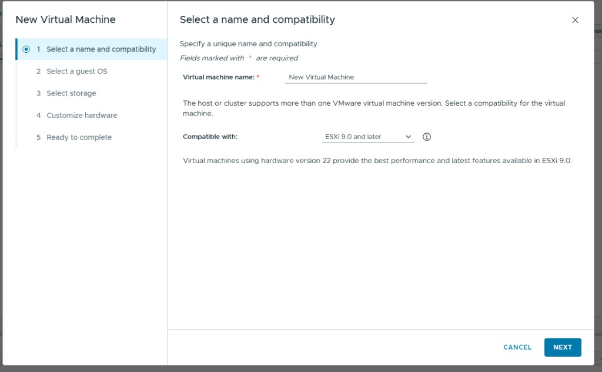

   Select a name and compatibility for the virtual machine. Set **Compatible with** to **ESXi 9.0 and later** (hardware version 22) for current performance and feature support on ESXi 9.x hosts.

Select the guest operating system
~~~~~~~~~~~~~~~~~~~~~~~~~~~~~~~~~~

On the **Select a guest OS** step, set **Guest OS Family** to **Linux**, set **Guest OS Version** to **Ubuntu Linux (64-bit)**, and click **Next**.

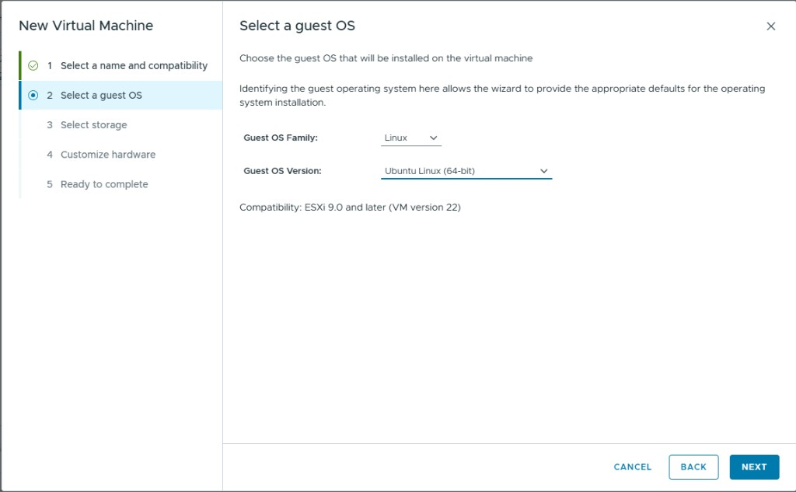

   Select the guest OS family and version. Set **Guest OS Family** to **Linux** and **Guest OS Version** to **Ubuntu Linux (64-bit)**.

Select storage
~~~~~~~~~~~~~~

On the **Select storage** step, choose the datastore where the VM will be stored (for example, ``datastore1``), and click **Next**.

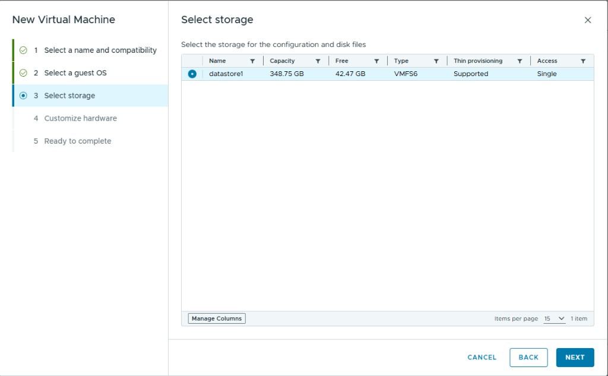

   Select the target datastore. Choose the datastore that has sufficient free space for the VM configuration files, virtual disk, and any ISO images you plan to attach.

Customize hardware
~~~~~~~~~~~~~~~~~~

On the **Customize hardware** step, configure CPU, memory, disk, and devices according to your workload requirements.

For **CD/DVD Drive 1**, select the drop-down, open the search dialog, select the ``.iso`` file you downloaded previously, close the dialog, and check the **Connect** checkbox on the CD/DVD Drive 1 row.

Under the **Memory** tab, expand the settings and tick **Reserve all guest memory**. You need this setting once passthrough is enabled.

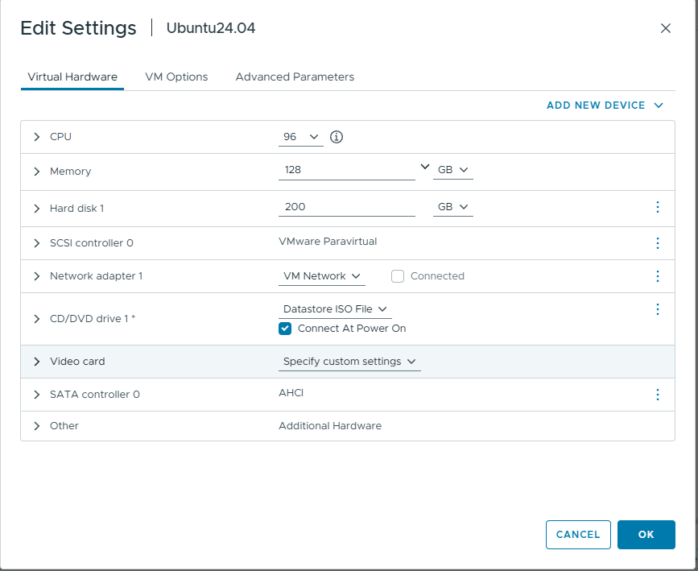

   Example VM hardware sizing and devices. Configure CPU, memory, and disk according to your workload. Enable **Connect At Power On** for the CD/DVD drive and select **Reserve all guest memory** under the Memory settings.

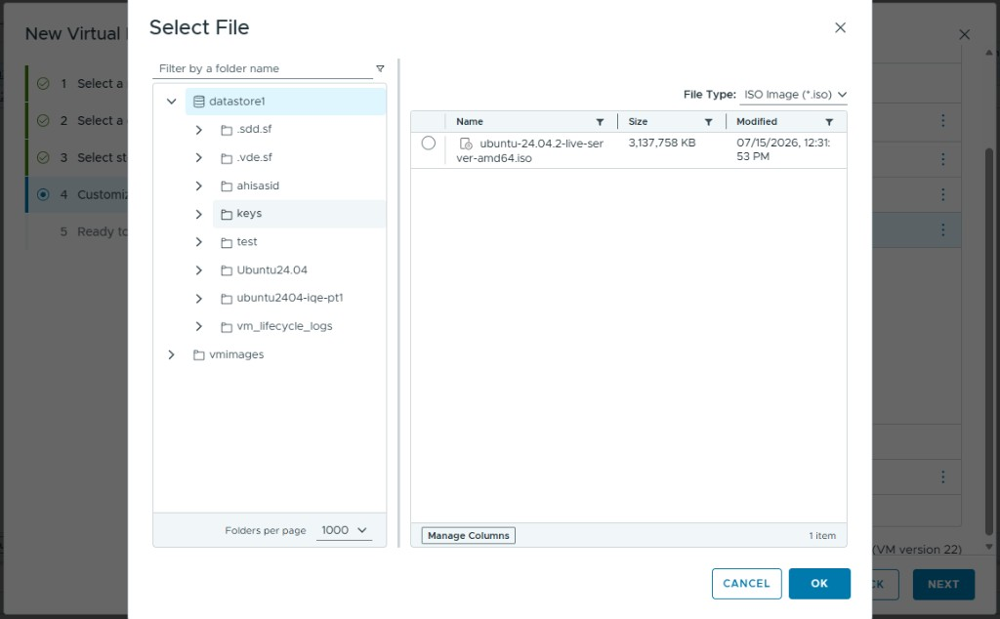

   Select the Ubuntu installer ISO for the CD/DVD drive. Browse the datastore, choose the downloaded ``ubuntu-24.04.2-*.iso`` file, and enable **Connect** on the CD/DVD Drive 1 row.

Install Ubuntu in the guest
----------------------------

Save the VM template and start the VM. Upon first boot, a console window loads the selected ``.iso`` installer. Depending on the image type, either graphical or command-line installation of Ubuntu begins. The installation process is the same as a standard Ubuntu install and is not covered in detail here.

After installation completes, verify the installation is working as expected. Then enable the SSH service and record the VM IP address.

.. tab-set::

   .. tab-item:: Linux guest shell

      .. code-block:: shell-session

         sudo apt install openssh-server
         sudo systemctl start ssh
         sudo systemctl enable ssh
         ip addr   # save the output of this command

   .. tab-item:: Server image shortcut

      If you used the Ubuntu server variant, a checkbox during installation can enable SSH automatically.

Pre-configure the guest before GPU assignment
----------------------------------------------

Before you assign MI350P GPUs to the VM, apply the following guest configuration steps.

Blacklist conflicting drivers
~~~~~~~~~~~~~~~~~~~~~~~~~~~~~~

Blacklist the ``amdgpu`` driver so the default installation does not hang on the first boot once GPUs are assigned. Also blacklist ``vmwgfx`` so other amdgpu-based tools and libraries can appropriately initialize and use the amdgpu driver.

Edit ``/etc/modprobe.d/blacklist.conf`` and add the following lines at the end of the file:

.. code-block:: text

   blacklist amdgpu
   blacklist vmwgfx

Then update the initramfs:

.. tab-set::

   .. tab-item:: Command

      .. code-block:: shell-session

         sudo update-initramfs -u

Disable the GUI (desktop image only)
~~~~~~~~~~~~~~~~~~~~~~~~~~~~~~~~~~~~

If you used the desktop image variant for Ubuntu, disable the graphical user interface (GUI). The MI350P does not support a graphical desktop in this passthrough configuration, and disabling the GUI removes error messages when loading the amdgpu driver later.

.. warning::
   After you run these commands, the GUI will no longer be usable in the ESXi web UI console view for the VM.

.. tab-set::

   .. tab-item:: Command

      .. code-block:: shell-session

         sudo systemctl stop gdm
         sudo systemctl set-default multi-user.target

Configure MMIO passthrough parameters
--------------------------------------

Power off the VM for GPU assignment and configuration. Open the VM edit window and navigate to **VM Options → Advanced → Edit Configuration**.

Add configuration properties (key-value pairs) using the **Add parameter** button. On ESXi 9.1, the following two parameters are required:

.. list-table:: Required MMIO passthrough parameters
   :header-rows: 1
   :widths: 40 60

   * - Parameter
     - Value
   * - ``pciPassthru.use64bitMMIO``
     - ``TRUE``
   * - ``pciPassthru.64bitMMIOSizeGB``
     - See sizing formula below

Size the MMIO aperture
~~~~~~~~~~~~~~~~~~~~~~~

The value of ``pciPassthru.64bitMMIOSizeGB`` depends on the application-specific integrated circuit (ASIC) and on how many GPUs are assigned to the VM. Compute it from the GPU's **VRAM BAR size** (its 64-bit prefetchable memory aperture, also called the framebuffer BAR), in GB, **not** the high-bandwidth memory (HBM) capacity, multiplied by the number of assigned GPUs:

.. code-block:: text

   pciPassthru.64bitMMIOSizeGB = B × N

where **B** is the per-GPU VRAM BAR size in GB and **N** is the number of assigned GPUs.

For the MI350P and MI350X, **B = 512 GB**. The following table shows example values:

.. list-table:: MMIO aperture sizing examples (MI350P and MI350X)
   :header-rows: 1
   :widths: 30 40 30

   * - GPUs assigned (N)
     - Calculation
     - ``pciPassthru.64bitMMIOSizeGB``
   * - 8
     - 512 × 8
     - ``4096``
   * - 4
     - 512 × 4
     - ``2048``
   * - 1
     - 512 × 1
     - ``512``

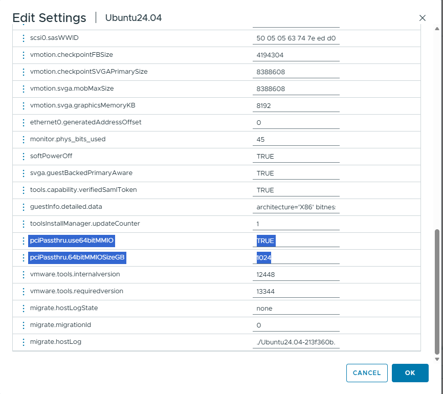

   Advanced VM configuration parameters for GPU passthrough. Add ``pciPassthru.use64bitMMIO = TRUE`` and set ``pciPassthru.64bitMMIOSizeGB`` to **B × N** (for example, ``4096`` for eight MI350P GPUs). The example screenshot shows a single-GPU configuration with ``64bitMMIOSizeGB = 1024``.

.. tip::
   Scale the MMIO aperture value proportionally when you assign fewer than eight GPUs to the VM.

Assign MI350P GPUs to the virtual machine
-----------------------------------------

With the VM powered off and MMIO parameters configured, open the VM edit window and complete the following steps:

#. On the **Virtual Hardware** tab, click **Add new device** and select **PCI Device**.
#. In the **Device Selection** dialog, select the MI350P entry with **Access Type: Fixed DirectPath IO** and click **Select**.
#. Confirm the added GPU appears in the Virtual Hardware list as a PCI device with **Access Type: Fixed DirectPath IO**.
#. Repeat the previous two steps for each additional GPU you want to assign to the VM.
#. Save the configuration.

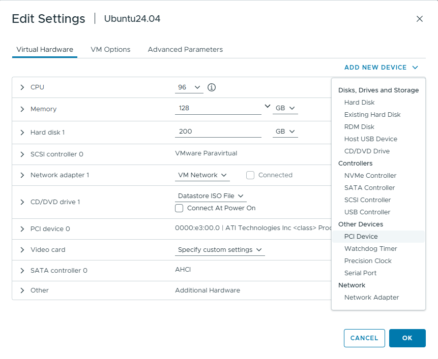

   Add a PCI Device from the **Add new device** menu. On the **Virtual Hardware** tab, open **ADD NEW DEVICE → Other Devices → PCI Device**.

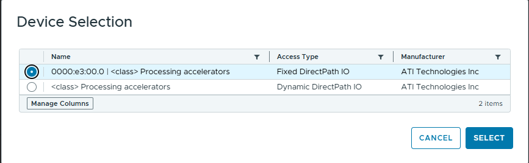

   Select the GPU (**Fixed DirectPath IO**) in the Device Selection dialog. Choose the device entry with **Access Type: Fixed DirectPath IO** (not Dynamic DirectPath IO) and click **Select**.

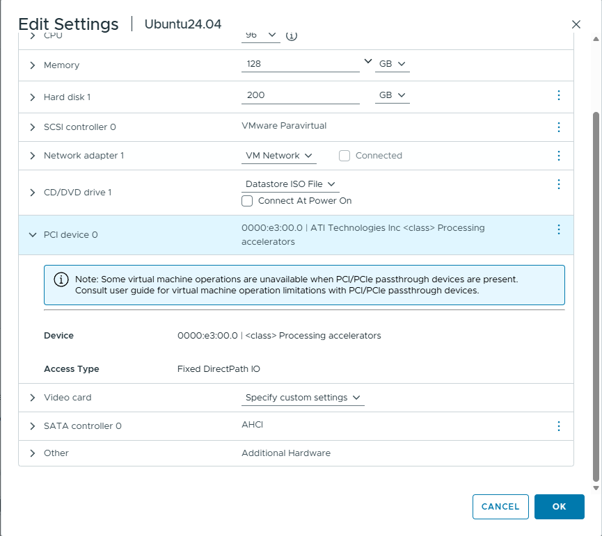

   MI350P PCI device assigned to the VM (**Fixed DirectPath IO**). The Virtual Hardware list shows the device bus, device, and function (BDF), manufacturer, and **Access Type: Fixed DirectPath IO**. Repeat for each additional GPU.

Verify GPU detection in the guest
----------------------------------

Start the VM again. Once the VM has booted successfully, SSH into it and verify that the GPU or GPUs are detected correctly:

.. tab-set::

   .. tab-item:: Command

      .. code-block:: shell-session

         lspci | grep -i amd

   .. tab-item:: Expected output

      ::

         XX:XX.X Processing accelerators: Advanced Micro Devices, Inc. [AMD/ATI] ...

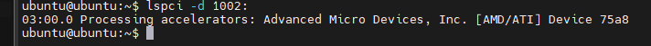

   Verify GPU detection inside the guest. Running ``lspci -d 1002:`` (or ``lspci | grep -i amd``) should list the MI350P GPU at the assigned PCI address. The ESXi UI may label the device class as **Processing accelerators**.

If the MI350P device or devices appear in ``lspci`` output, the passthrough configuration is successful. Proceed to :doc:`Install ROCm and the AMD GPU driver <install-rocm>` to install the AMDGPU driver and ROCm components in the guest.
